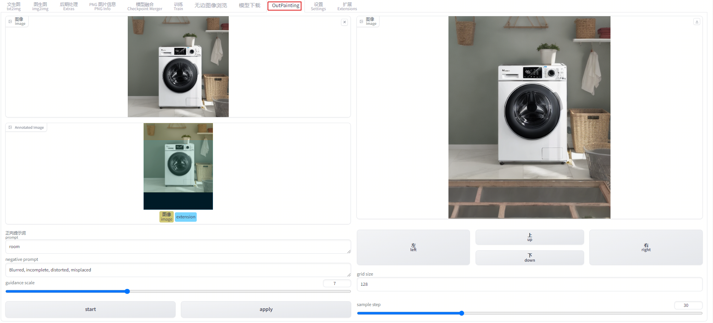

# sd_webui_outpaint

Extension for [webui](https://github.com/AUTOMATIC1111/stable-diffusion-webui). This is a outpainting to image demo using diffusers and the [gradio library](https://github.com/gradio-app/gradio). 

Find the UI for Outpainting in the Extras tab after installing the extension.

# Installation

Install from webui's Extensions tab.

# Credits

* outpainting library that does all the work: https://github.com/WatchTower-Liu/diffusion-outpainting
